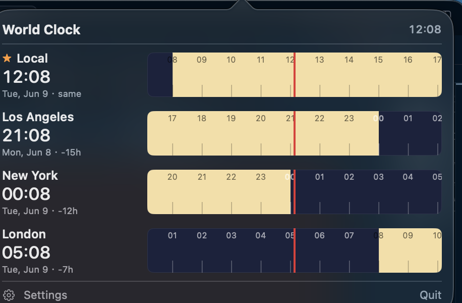

# World Clock

A lightweight macOS **menu-bar** app that shows several time zones as stacked
**timeline strips** aligned on a single "now" line. Built for personal local use
— no App Store, no Dock icon.



## What it does

- Sits in the top-right **menu bar** showing your **primary zone's** time + a
  clock icon (no Dock icon — it's a menu-bar agent).
- Click it to open a popover with **one horizontal timeline per zone**, stacked.
- Each strip spans **±5 hours around now (10h total)**. A single **orange
  center line** marks the current instant across every strip — so each zone's
  local time at "now" lines up vertically (e.g. 11:28 Beijing aligns with 04:28
  London on the same line).
- **Asleep/awake shading** on each strip (asleep = dark/cool, awake = warm/light)
  so you can see at a glance who's up. The asleep window defaults to **00:00–08:00**
  and is configurable in Settings (editable start/end + one-tap presets), applied
  globally to every zone. It wraps past midnight (e.g. 22:00–06:00).
- Hour ticks with labels; midnight is emphasised; each row shows the zone's
  current date and its offset from your local zone (e.g. `-7h`, `+5.5h`).

## Requirements

- macOS 14+ (developed/tested on macOS 26, Apple Silicon).
- Swift toolchain (Command Line Tools is enough — **no full Xcode required**):
  ```sh
  xcode-select --install   # if not already present
  swift --version
  ```

## Build & run

```sh
./scripts/build_app.sh        # compiles (release) and assembles build/WorldClock.app
open build/WorldClock.app     # launches it; look top-right in the menu bar
```

To install it for everyday use, drag `build/WorldClock.app` into `/Applications`.

### First launch (Gatekeeper)

The app is **ad-hoc signed, not notarized** (it's for personal use). If macOS
blocks the first launch, right-click the app → **Open** → **Open**, or:

```sh
xattr -dr com.apple.quarantine build/WorldClock.app
```

## Using it

- **Click the menu-bar item** to open/close the timeline popover.
- **Settings** (gear button in the popover, or it opens its own window):
  - **Add Zone** — searchable list of all IANA zones (search "Tokyo", "London", …).
  - **Rename** — type a friendly name in each row (e.g. "HQ", "Beijing").
  - **Reorder** — drag rows.
  - **Remove** — swipe / delete.
  - **Star** a zone to make it the one shown in the menu bar.
  - **Use 24-hour time** toggle.
  - **Launch at login** toggle (works best once the app lives in `/Applications`).
  - **Sleep / Awake** — set the global asleep window (defaults 00:00–08:00) by
    editing the start/end hours, or tap a preset: Default (00:00–08:00),
    Early bird (22:00–06:00), Night owl (02:00–10:00).

## Configuration storage

Zones and preferences persist in `UserDefaults` (domain `com.rory.worldclock`)
as JSON. A corrupt or missing payload falls back to a sensible default set
(your local zone + Los Angeles, New York, London, Shanghai). Stored zone
identifiers are re-validated on load; unknown ones are dropped, never silently
mapped to the wrong zone.

To reset to defaults:

```sh
defaults delete com.rory.worldclock
```

## Troubleshooting

| Symptom | Fix |
|---|---|
| No item in the menu bar | The menu bar may be full (especially on notched Macs — items get hidden behind the notch). Quit other menu-bar apps or use a manager like [Ice](https://github.com/jordanbaird/Ice). Confirm it's running: `pgrep -lf WorldClock`. |
| "App can't be opened" on first launch | Right-click → Open, or run the `xattr` command above. |
| Launch-at-login toggle errors | Move the app to `/Applications` first; `SMAppService` is happier with a stable location. |
| Times look wrong after a DST change | They shouldn't — ticks use real `Calendar` instants. If you see an issue, `defaults delete com.rory.worldclock` and re-add the zone. |

## Project layout

```
Package.swift                 SwiftPM executable target
Sources/WorldClock/
  main.swift                  AppKit entry point (.accessory policy)
  AppDelegate.swift           NSStatusItem + NSPopover + settings window
  Models/
    ClockZone.swift           Codable, validated zone model
    SettingsStore.swift       persistence + validation + defaults
    TimelineGeometry.swift     pure tick / day-night math
    Formatting.swift          cached time formatters
  Views/
    PopoverView.swift          stacked rows + header/footer + empty state
    TimelineRow.swift          left label block + strip
    TimelineCanvas.swift       day/night fill, ticks, center line
    SettingsView.swift         zone management UI + AddZoneSheet
scripts/build_app.sh          build + bundle
docs/ADR-0001-*.md            architecture decisions
```

## Why AppKit and not SwiftUI's `MenuBarExtra`?

See [docs/ADR-0001](docs/ADR-0001-stack-and-bundling.md). Short version: a pure
SwiftUI `MenuBarExtra` did not create its status item when built as a plain
SwiftPM executable (no Xcode app), so the lifecycle is AppKit while all the
views remain SwiftUI.
